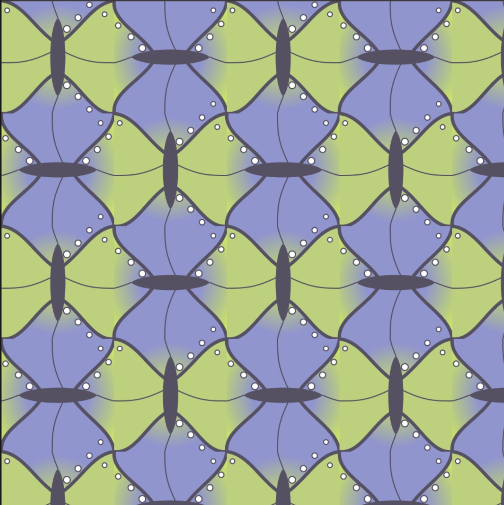
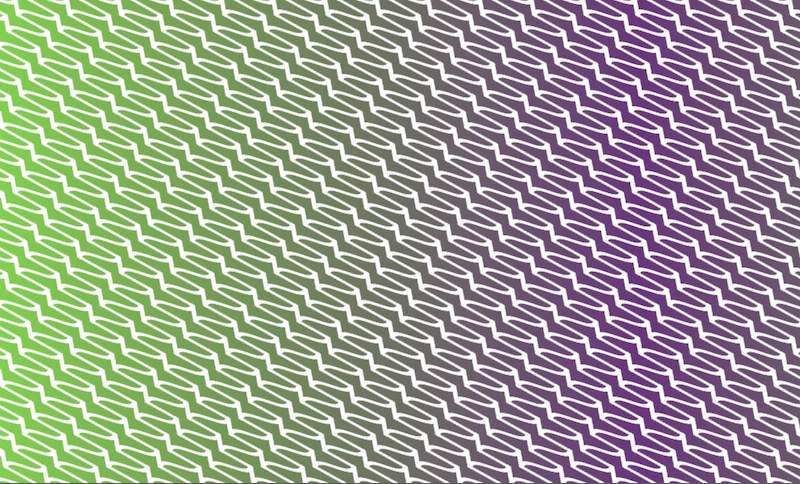

# Tesselations

### I am working on tesselations in this repo.  

## Butterfly tesselation

### I am using the bezier curve to create the butterfly object.  I am using the [p5.PatGrad](https://github.com/antiboredom/p5.patgrad) to add the fill color to each tile.

- [Code](https://github.com/kfahn22/tesselation/tree/main/BEZIER_TESSELATIIONS/butterfly)
- [P5 sketch](https://editor.p5js.org/kfahn/full/WEiU90gSw)

## Tesselation with shear

### This is my first attempt at creating a tesselation  using sheer.  While it works, the parameters are hard coded, so I am working on trying to create an algorithm that is generic.

